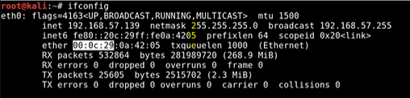

## 📘 Introduction

As an ethical hacker, understanding MAC (Media Access Control) addresses is crucial for activities like **network sniffing**, **spoofing**, and **bypassing access controls**. MAC addresses operate at **Layer 2** of the OSI model and are essential for communication within local networks (LANs).

---

## 🧱 Basics of MAC Address

### What is a MAC Address?
- **MAC** stands for **Media Access Control**
- A **hardware-based** address assigned to a network interface card (NIC)
- 48-bit address, usually written as `00:1A:2B:3C:4D:5E`
- Permanently burned into the device by the manufacturer (but can be changed)

### OSI Layer
| Layer | Name              | Role                     |
|-------|-------------------|--------------------------|
| 2     | **Data Link Layer** | Device-to-device communication over LAN |

### Purpose
- Used by **switches** to forward frames to the correct port/device
- Ensures that data on a LAN reaches the correct machine, even if multiple devices share the same IP subnet

---

## 🧠 MAC Address Structure

- First 24 bits → **OUI (Organizationally Unique Identifier)** = Manufacturer
- Last 24 bits → **NIC Specific Identifier**

> 🔍 Example: `FC:FB:FB:01:FA:21`
> - OUI: `FC:FB:FB` → Belongs to Apple
> - Device: A specific Apple device

You can look up manufacturers using tools or sites like `macvendors.com`.

---

## 💻 Role in Ethical Hacking

### Useful for:
- **Network Enumeration**:
  - Tools like Wireshark show MAC addresses in sniffed packets
- **MAC Spoofing**:
  - Change MAC to bypass access control (e.g., MAC filtering on routers)
  - Tools: `macchanger`, `ifconfig`, `ip link`
- **Reconnaissance**:
  - Identify device types or vendors (e.g., printers, routers)
- **ARP Poisoning**:
  - ARP maps IP ↔ MAC — manipulating this can allow MITM (Man-in-the-Middle) attacks

> ⚠️ Ethical Note: Only spoof or sniff on networks you are authorized to test. Unauthorized manipulation of MAC can violate network policies and laws.

---

## 🚦Switch vs Hub Behavior

| Device  | How it handles MAC |
|---------|---------------------|
| **Switch** | Uses MAC table to send data only to correct port |
| **Hub**    | Broadcasts data to all ports (less secure, outdated) |

> 🎯 In a **switched network**, MAC spoofing and ARP spoofing are used to trick the switch into sending data to the attacker.

---

## 🧠 Concepts Related to MAC Address

- MAC address filtering (wireless security)
- Dynamic Host Configuration Protocol (DHCP) & MAC leases
- ARP table poisoning (tool: `arpspoof`, `ettercap`)
- Port Security on switches (MAC sticky)
- MAC flooding attacks (overload switch's MAC table)
- Difference between MAC and IP roles
- Permanent vs Temporary MAC addresses in modern OSes

---

> 🛠️ **Practice Tip**: Try using `ip link`, `macchanger`, or `getmac` (Windows) to view and spoof MAC addresses in a lab environment.

